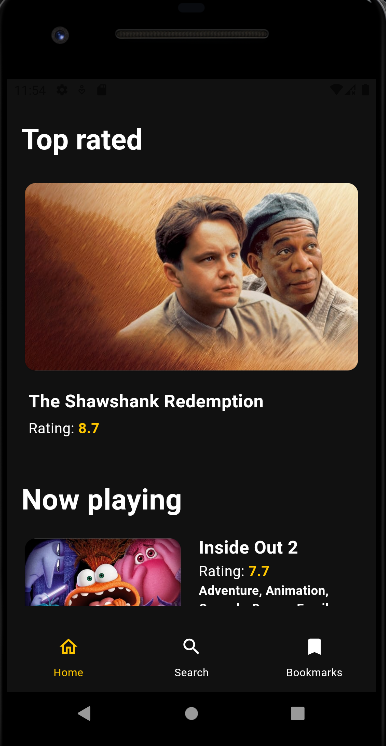

# Desafio técnico iFood

Este repositório é referente a um desafio técnico proposto pelo iFood. A seguir estão descritas as características do desafio escolhido, bem como as tecnologias e arquitetura utilizada. 

## Sobre a aplicação

A aplicação consiste na listagem de filmes consumidos pela API do database The Movie Database(TMDB). Dentre as funcionalidades do escopo inicial, encontram-se :

- Listagem dos 20 mais bem avaliados;
- Listagem dos filmes em cartaz, com paginação;
- Busca de filmes por palavra chaves;
- Favoritos;

 **Obs: A funcionalidade de favoritos não foi finalizada completamente devido ao tempo para desenvolvimento, mas pretendo finalizá-la assim que possível, mesmo após a avaliação do projeto.

  O projeto possui suporte a internacionalização, sendo atualmente suportado para os idiomas Inglês(padrão) e Português(BR).

  Também foi iniciado um pequeno submódulo de Design System, para mostrar o quão escalável a arquitetura e estrutura proposta pode ser. Nele foram implementados, somente recursos utilizados por demanda do escopo inicial do projeto.

  ### Preview
  

## Testes

O projeto está sendo entregue com um **coverage** de **97%** que foi alcançado através de testes unitários, testes de bloc/cubit e testes de widget.

## Arquitetura

O projeto foi concebido com base na **Arquitetura Limpa** e de forma modular (não é o package). O projeto foi **dividido** em **módulos** no intuito de ter uma aplicação **desacoplada** e **escalável**, além de simular um projeto real que possa necessitar de várias squads atuando no mesmo projeto, desafio comumente presente em aplicativos de empresas grandes como o iFood. Com base em minha experiência, tentei criar uma estrutura desacoplada de módulos, porém mesmo que independentes, seguindo todo o protocolo e regras da arquitetura definida (Arquitetura Limpa).

Meu objetivo desde o início foi desenvolver um projeto que sirva como estado da arte ou até mesmo um template para desenvolvedores que queiram ter um projeto base como referência e/ou ponto de partida. Ressalto que a estrutura utilizada foi uma abstração da Arquitetura Limpa de forma modular.

## Tecnologias

- **Flutter** v3.22.2 (channel stable);
- Bloc com package _flutter_bloc_;
- Programação funcional com package _dartz_;
- Injeção de dependência com package _get_it_;
- Internacionalização com package _flutter_localizations_;
- Requisições remotas com package _dio_;

## Pendências e melhorias futuras

Apenas a funcionalidade proposta de **Favoritos** não foi concluída devido a falta de tempo, mas seu módulo foi criado e feito uma tratativa de exibição "Em breve" desta funcionalidade.

**Melhorias futuras** que pretendo fazer com o tempo, mesmo após a avaliação do projeto:

- **Classe de log e observabilidade**. Pretendo criar uma classe para realização de observabilidade e monitoramento de logs de erro para que se em algum cenário for necessário a telemetria através de alguma ferramenta como dynatrace ou firebase por exemplo, seja necessário apenas implementar nesta classe e não no app todo.
- **Acessibilidade assistiva com leitor de telas**. Pretendo também adicionar acessibilidade assistiva para usuários que utilizam o leitor de telas. O flutter tem este suporte e já utilizei em outros projetos que participei, mas pelo tempo não consegui colocar neste escopo inicial;
- Testes de integração;
- Módulo de detalhes de um filme;
- Suporte a troca de temas (claro e escuro);
- Customização das splash screen nativas e do flutter;

## Considerações finais
Agradeço sua atenção e tempo se chegou até aqui na avaliação deste projeto. Dediquei boa parte das minhas horas de descanso para desenvolver o mesmo e espero de alguma forma contribuir poupando tempo de outros desenvolvedores com este modelo para ser estudado e reutilizado caso faça sentido para algumas pessoas.

Se gostou, não esqueça de deixar um like no repositório!
